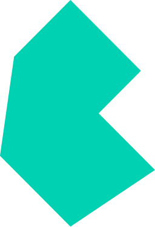

  <h1 align="center">
    Hi there!
    
  </h1>
  
If you are here to know a little bit more about me, you're in the right place. Let's start!

 

## `👀` Who am I ?

> Hello! I'm retouching, mainly website backend developer but I can do other stuffs. Some projects can be found in my [repositories](https://github.com/retouching?tab=repositories) tab.

## `🛠️` Technologies that I can use

### Languages and extensions:

### Libraries:

### Frameworks:

### Databases:

### Others:

  <h1 align="center">
    
    
  </h1>

## `🍕` Links

- Bento: [bento.me/arch](https://bento.me/arch)
